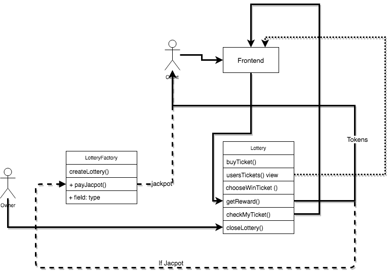

https://docs.google.com/document/d/19fUA7G12evVqWVWOX4EYADZRMUIVjICkaYigeaAFaPU/edit

  

# Админ часть:
1. Owner контракта LotteryFactory вызывает функцию createLottery()
 
  1.1 uint256 sellOverBlock  - блок после которого закрывается возможность покупать билеты
  
  1.2 uint256 stopLotteryBlock - блок до которого организатор лотереи (owner) должен вызвать метод chooseWinTicket() и запустить случайный выбор билета - победителя. В случае если это сделано не будет то клиенты могут забрать свои деньги за билет.
  
  1.3 uint256 closeLotteryBlock - блок до которого пользователи должны забрать свои призы, после него организатор имеет право вызвать метод closeLottery() и закрыть лотерею переведя все токены с баланса лотереи.
  
  1.4 uint256 tokenAmount кол-во токенов выделяемое на данный розыгрыш.
После того как пройдет блок blockForRandom, который рассчитывается при создании лотереи и лежит в промежутке между sellOverBlock и stopLotteryBlock,  Owner должен запустить выбор билета победителя.
После того как будет “добыт” блок номер closeLotteryBlock, owner должен вызвать метод closeLottery(), и закрыть текущий розыгрыш.
аргументами передаются следующие параметры:

# Клиентская часть

1. Клиент через фронтенд вызывает функцию  buyTicket(), на контракте записывается его билеты

2. Билеты пользователя отображаются ему на фронтенде

3. после  розыгрыша winTicket на фронтенде отображается билет - победитель

4. Пользователю отображается его выигрыш использовав функцию checkMyTicket()
5. Если пользователь что - то выиграл то вызывает с фронта функцию  getReward, если он выиграл джекпот то контракт Lottery отправляет запрос на выплату джекпота на  LotteryFactory + выплачивает баланс Lottery. 
6. Если Owner не разыграл в срок победный билет пользователь может получить refund.
